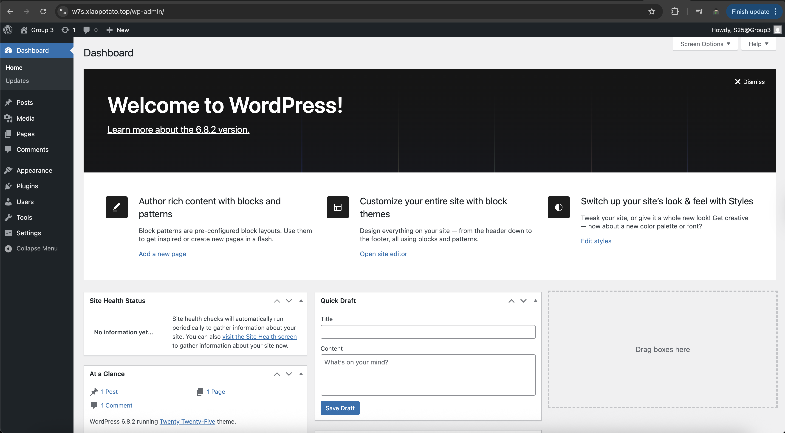
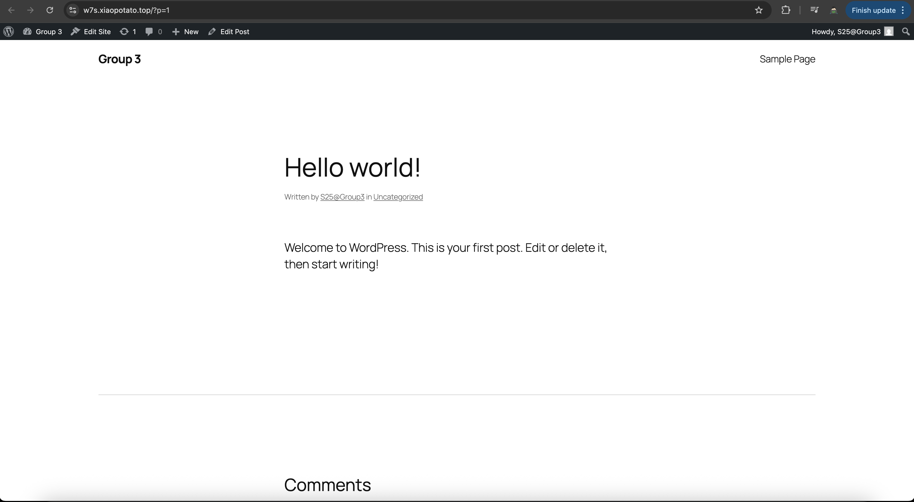
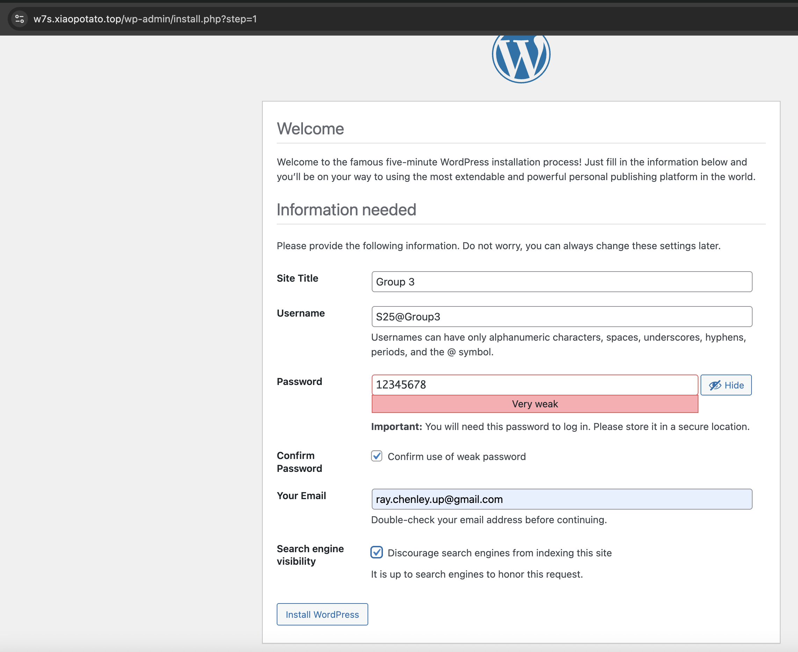

# Wordpress Micro Frontend

url: https://w7s.xiaopotato.top/wp-admin/
account: S25@Group3 Pwd: 12345678





consume microfrontends and do distributed tracing with OTEL

```bash
docker compose up -d
```

Use this as a starting point for instrumenting your app. https://docs.splunk.com/observability/en/gdi/opentelemetry/components/sqlquery-receiver.html should be helpful.

Use https://github.com/diy-pwa/one-click-child-theme to enqueue the micro frontend code. YMMV.
